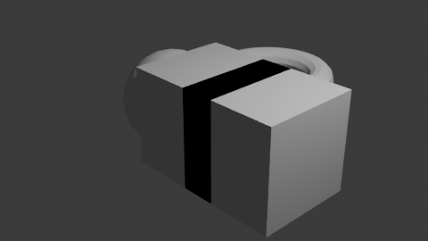

# Golden Set — Verification-Gate Calibration (SPEC §8)

**Result: ✅ PASS** — the probe returns the correct state for every golden artifact across Blender 3.6 / 4.2 / 4.5.

Probe images are built from official `download.blender.org` tarballs pinned by SHA-256 (SPEC §12.1(1)); render check is Cycles-CPU (SPEC §12.1 render deviation).

| artifact | 3.6 | 4.2 | 4.5 | why |
|---|---|---|---|---|
| `golden_good_cube` | `pass`✓ | `pass`✓ | `pass`✓ | clean generator; operator creates geometry via bmesh and drives headless -> full 5-check pass. |
| `golden_noop` | `partial`✓ | `partial`✓ | `partial`✓ | enables + registers an operator + renders, but the operator makes no geometry -> no smoke delta. |
| `golden_legacy_27x` | `legacy`✓ | `legacy`✓ | `legacy`✓ | declares blender (2,7,9); register_module was removed in 2.8+ so it never registers -> legacy. |
| `golden_broken` | `fail`✓ | `fail`✓ | `fail`✓ | not a valid zip archive -> install cannot even begin. |
| `antlandscape` | `skipped_incompatible`✓ | `partial`✓ | `partial`✓ | extension (min 4.2): no extension system on 3.6 -> skipped_incompatible (rider 4, not a wasted fail); mesh.landscape_add is dialog-only headless -> partial. |
| `ivygen` | `skipped_incompatible`✓ | `partial`✓ | `partial`✓ | extension (min 4.2); 3.6 skipped_incompatible; curve.ivy_gen dialog/context-dependent headless -> partial. |
| `tissue` | `skipped_incompatible`✓ | `pass`✓ | `pass`✓ | extension (min 4.2); 3.6 skipped_incompatible; a tessellation operator produces a mesh delta headless -> pass. |
| `cellfracture` | `skipped_incompatible`✓ | `pass`✓ | `pass`✓ | extension (min 4.2); 3.6 skipped_incompatible; a fracture operator produces geometry headless -> pass. |
| `sapling` | `skipped_incompatible`✓ | `skipped_incompatible`✓ | `pass`✓ | extension min 4.4 -> below-minimum on BOTH 3.6 and 4.2 -> skipped_incompatible (rider 4); curve.tree_add drives headless on 4.5 -> pass. The version-gating proof. |

## Prescan gate (SPEC §3.4)

| fixture | expected | got | |
|---|---|---|---|
| `golden_danger` | needs_review | `needs_review` | ✓ |
| `golden_good_cube` | clean | `clean` | ✓ |
| `golden_noop` | clean | `clean` | ✓ |

## What this calibrates

- **All five result states** exercised: `pass` (good_cube, tissue, cellfracture, sapling@4.5), `partial` (antlandscape, ivygen, noop), `fail` (broken, ext@3.6), `legacy` (2.7x add-on). `quarantine` is exercised by the wall-clock cap in probe.py.
- **Version gating is real**: `sapling` (min 4.4) is `fail/fail/pass`; every 4.2+ extension is `fail` on 3.6 (no extension system pre-4.2).
- **Honest headless limit**: dialog-only generators (A.N.T. landscape_add returns `PASS_THROUGH` headless) correctly land at `partial`, which still counts toward coverage.
- **Prescan blocks danger** before any container run; benign fixtures pass clean.

_Headless Cycles-CPU render produced inside the `--network none` sandbox — proof the render check (§3.1 step 5) works across the emulated matrix._
